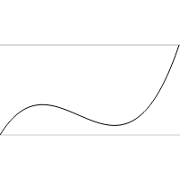
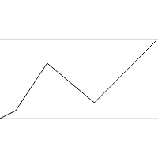
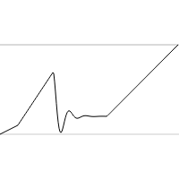
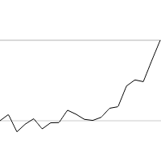
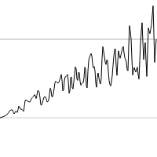
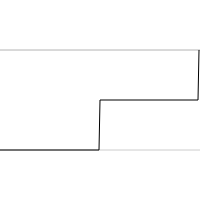
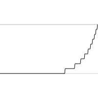
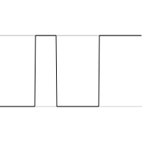
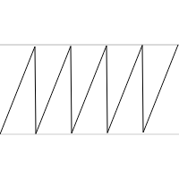
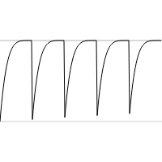

# eases-fancy

[](http://github.com/badges/stability-badges)

This is a set of easing equations which are outside of standard Penner easing equations.

## Usage

You can require in individual functions using require statements before or access them directly by requiring in `'eases-fancy'`.

Example:
```javascript
var mod = require('ease-fancy/mod');
// or by doing
var mod = require('eases-fancy').mod;
```

[](https://www.npmjs.com/package/eases-fancy)

### `var bezier = require('eases-fancy/bezier')([opts])`



*`Above rendering a custom bezier curve`*

This function will return an ease equation based on a cubic bezier curve.

It should be noted this simply wraps the [`cubic-bezier`](http://www.npmjs.com/cubic-bezier) module to have a consistent api with the rest of the fancy eases.

Optionally you can pass in the following options:
- `points` an array of four numbers which represent a cubic bezier curve default `[0.21,1.08,1,-0.96]`
- `precision` the higher the value the more precise the curve will be default value `1000`.


### `var points = require('eases-fancy/points')([opts])`



*`Will render a series points which define an easing equation`*



*`This is the exact same graph as above with an elastic out ease equation added
to the second keyframe`*

Returns a function that will perform eases based on custom points you've passed in.

Options:
- `points` a two dimensional array that is formatted in the following way:
```javascript
[
    [ value, time, ease ],
    [ value, time, ease ],
    [ value, time, ease ]
]
```

In the above arrays `value` is a value the interpolation amount at the time defined by `time` and `ease` is an optional ease function which will be used to to the following key frame. `values`'s are typically between 0-1 however values less than 0 or greater than 1 are also acceptable. Optionally an ease function can be passed as the third parameter for more complex graphs.


### `var pointsRandom = require('eases-fancy/points-random')([opts])`



*`The above is rendering the quint function randomized`*



*`The above is rendering 100 randomized points which for an ease equation which taper out`*

Options which can be passed to `points-random`:
- `numPoints` this is how many random points you'd like to add. Default `20`
- `offset` this value is how offset each random point is off the original ease quation. Default `0.3`
- `ease` the base ease equation to randomize from. Default is a linear ease equation.


### `var stepped = require('eases-fancy/stepped')([opts])`



*`Rendering with two steps`*



*`Rendering with two steps and ease expo`*

Returns an easing function for stepped eases with the following optional options:
- `steps` the number of steps you'd like to have. The above is with two steps. Default value `1`
- `ease` an ease equation which will modify the original steps.
- 
### `var quantize = require('eases-fancy/quantize')([opts])`


*`Rendering quantize with a linear interpolated graph`*



*`Rendering quantize with a custom ease using the above mentioned points`*

`quantize` will make all values be either 0 or 1. This could be used for instance to blink on and off something.

Options:
- `ease` an ease function we'd like to quantize. Default `linear`
- `edge` a threshould value from which to either set values to 0 or 1. For instance if edge is 0.3 all values less than 0.3 will produce 0 and all values greater will produce 1. Default `0.5`.

### `var mod = require('eases-fancy/mod')([opts])`



*`Rendering mod with defaults. (repeats linear ease over and over)`*



*`Rendering mod with a custom ease.`*

`mod` will repeat an ease function the number of times you ask it to.

Options for `mod`:
- `ease` ease function which will be repeated. Default `linear`.
- `repeat` count times you'd like to repeat the ease function. Default `5`

## License

MIT, see [LICENSE.md](http://github.com/Jam3/eases-fancy/blob/master/LICENSE.md) for details.
